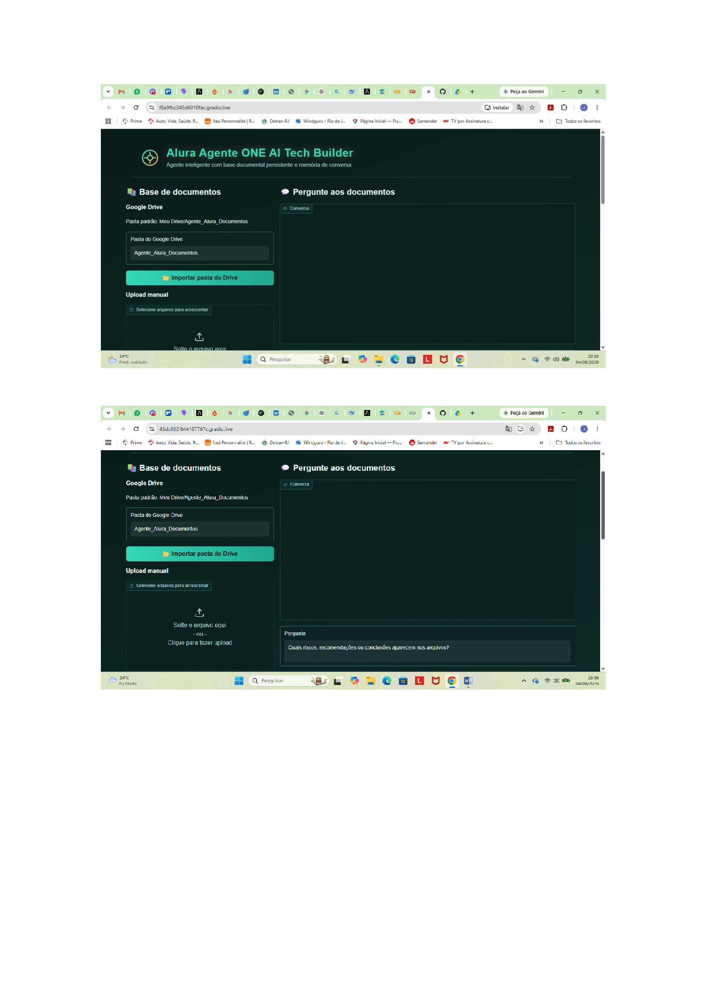
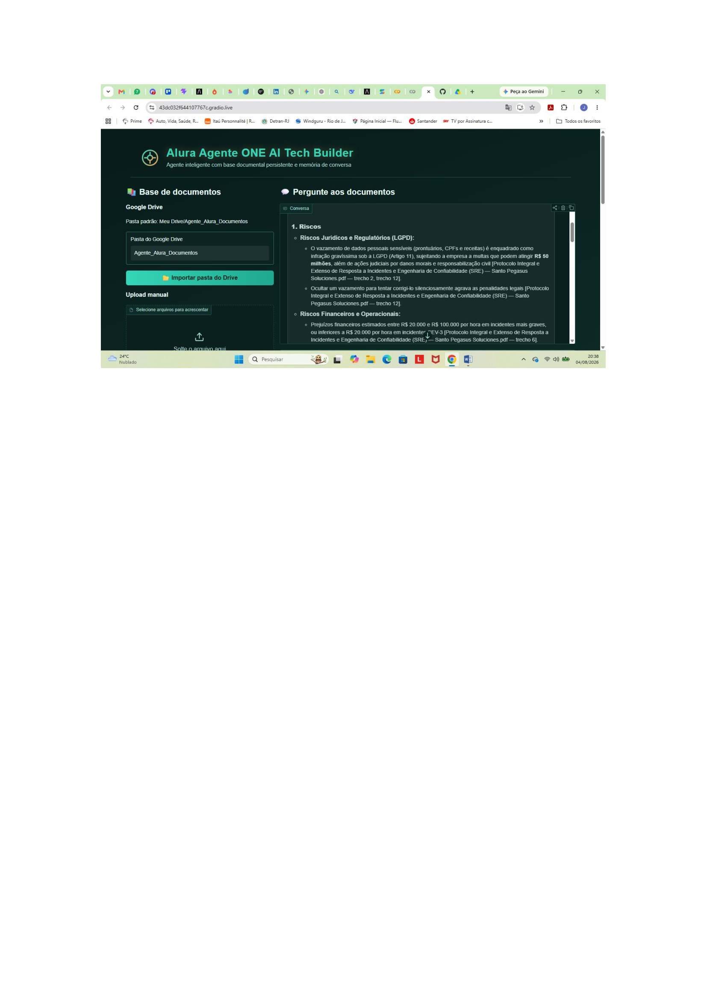

# 🤖 Alura-Agente-ONE-AI-Tech-Builder

Agente de *RAG (Retrieval-Augmented Generation)* com base documental persistente no Google Drive, memória de conversa e interface web via Gradio. Desenvolvido como evolução do desafio da Alura, usando *Google Gemini* para geração de respostas e *FAISS* para busca semântica.

Agente de IA desenvolvido como parte do desafio **ONE AI Tech Builder**. 
Ele foi criado para atuar como um assistente virtual especializado na análise e consulta de documentos técnicos da Santo Pegasus Soluciones, uma empresa de tecnologia do setor de saúde

## 📋 Sobre o projeto

Este agente permite que você "converse" com seus próprios documentos (PDF, TXT, MD ou DOCX): ele lê os arquivos, quebra o conteúdo em trechos, gera embeddings semânticos, indexa tudo com FAISS e usa o Gemini para responder perguntas *exclusivamente com base no que está nos documentos*, citando a fonte de cada resposta.

### Principais funcionalidades

- 📂 *Importação automática do Google Drive* — aponta para uma pasta e o agente cataloga todos os PDFs, TXTs, MDs e DOCXs nela.
- ⬆️ *Upload manual* de arquivos direto pela interface.
- 💾 *Base persistente* — os documentos, trechos e o índice vetorial são salvos no Drive, então nada se perde ao reiniciar o notebook.
- 🔁 *Deduplicação por hash* — arquivos repetidos não são reprocessados.
- 💬 *Conversa com memória* — histórico real de chat (múltiplos turnos), não só perguntas isoladas.
- 🔎 *Painel de fontes* — mostra exatamente qual trecho de qual arquivo embasou cada resposta, com o score de similaridade.
- 🗂️ *Gerenciador de documentos* — remove um arquivo específico da base sem precisar apagar tudo.
- 💾 *Exportação da conversa* em .txt.
- 🔀 *Fallback entre modelos Gemini* — se um modelo estiver indisponível ou sobrecarregado, o agente tenta automaticamente o próximo da lista (com retry para erros temporários).
- 🎨 *Interface personalizada* — tema escuro com identidade visual própria.

## 🧱 Arquitetura técnica

| Camada | Tecnologia | Detalhe |
|---|---|---|
| Interface | Gradio (Blocks) | Tema customizado + CSS próprio |
| Extração de texto | pypdf, python-docx | PDF, DOCX, TXT, MD |
| Chunking | Janela deslizante por palavras | 450 palavras por trecho, sobreposição de 80 |
| Embeddings | sentence-transformers (paraphrase-multilingual-MiniLM-L12-v2) | Multilíngue, 384 dimensões |
| Índice vetorial | FAISS IndexFlatIP | Busca por similaridade de cosseno (vetores normalizados) |
| Geração de resposta | Google Gemini (google-genai) | Fallback entre gemini-3.6-flash → gemini-3.5-flash → gemini-3.5-flash-lite |
| Persistência | Google Drive | Chunks (.pkl), metadados (.json) e índice (.faiss) |

## 🚀 Como executar (Google Colab)

### 1. Pré-requisitos
- Uma conta Google com acesso ao Google Colab e Google Drive.
- Uma chave de API do [Google AI Studio](https://aistudio.google.com/apikey) (gratuita).

### 2. Configurar o Secret no Colab
1. No Colab, clique no ícone de 🔑 *Secrets* na barra lateral esquerda.
2. Crie um novo secret chamado *ALURA_AGENTE_API_KEY*.
3. Cole sua chave da API do Gemini como valor.
4. Ative o acesso do notebook a esse secret.

### 3. Instalar as dependências
Na primeira célula do notebook, execute:

python
!pip install -q -U gradio faiss-cpu sentence-transformers pypdf python-docx google-genai

### 4. Rodar o agente
Execute o script challenge_alura_agente_one_ai_tech_builder.py (ou cole o conteúdo em uma célula do Colab). Ele vai:

1. Montar seu Google Drive.
2. Criar a pasta Agente_Alura_Documentos em Meu Drive, se ainda não existir.
3. Catalogar automaticamente qualquer documento que já esteja nessa pasta.
4. Abrir a interface Gradio com um link público temporário (*.gradio.live).

### 5. Usar a interface
- *Aba/painel "Base de documentos"*: importe uma pasta do Drive ou envie arquivos manualmente.
- *Painel "Pergunte aos documentos"*: digite sua pergunta e converse com o agente.
- Use o *dropdown de remoção* para tirar um documento específico da base.
- Use *"Exportar conversa"* para baixar o histórico em .txt.

## 📂 Documentos Analisados

- Arquitetura de Microsserviços e Mapa de Domínios
- Guia Oficial de Engenharia Back-end
- Guia Oficial de Engenharia Front-end
- Manual de Onboarding
- Protocolo de Resposta a Incidentes (SRE)

## 📁 Estrutura de dados no Drive

Meu Drive/
├── Agente_Alura_Documentos/       # Pasta onde você coloca os arquivos de origem
│   ├── relatorio.pdf
│   └── manual.docx
└── alura_agente_base/             # Gerada automaticamente pelo agente
    ├── arquivos/                  # Cópia dos documentos já catalogados
    ├── chunks.pkl                 # Trechos de texto extraídos
    ├── metadados.json             # Metadados de cada trecho (arquivo, hash, nº do chunk)
    ├── indice.faiss                # Índice vetorial FAISS
    └── exportacoes/                # Conversas exportadas em .txt

## ⚙️ Formatos suportados

| Formato | Extensão |
|---|---|
| PDF | .pdf |
| Texto simples | .txt |
| Markdown | .md |
| Word | .docx |

## 📝 Exemplo de Perguntas

- "Qual é o princípio arquitetônico que proíbe o acesso direto ao banco de dados de outro microsserviço?"
- "Quais são os pilares da cultura Engineering Excellence da Santo Pegasus?"
- "Como funciona o fluxo de resposta a incidentes SEV-1?"
- "Quais tecnologias são utilizadas no ecossistema back-end?"

## 📷 Capturas de Telas

### Agente Funcionando

### Interação com o agente - pergunta respondida

## ✅ Status do Agente

O agente está **funcionando perfeitamente**, processando consultas sobre a documentação técnica da Santo Pegasus Soluciones com **tempo médio de resposta inferior a 2 segundos**.

- ✅ Extração de PDFs: OK
- ✅ Processamento de texto: OK
- ✅ API Gemini: OK
- ✅ Respostas baseadas em contexto: OK

## 🩺 Solução de problemas

*"Nenhum modelo Gemini respondeu"*
Normalmente é sobrecarga temporária (erro 503) ou um modelo descontinuado (erro 404). O agente já tenta 3 modelos em cascata com novas tentativas automáticas. Se ainda assim falhar em todos, é instabilidade geral da API no momento. Tente novamente em alguns minutos.

*"A base está vazia"*
Confirme se há arquivos na pasta do Drive configurada ou envie arquivos pela seção de upload manual.

*Erro de Secret ausente*
Verifique se o secret ALURA_AGENTE_API_KEY foi criado corretamente e se o notebook tem permissão de acesso a ele (toggle ativado no painel de Secrets).

*Documento não é reprocessado após edição*
A deduplicação é feita por hash do arquivo. Se você editar um documento já catalogado, ele será tratado como um arquivo novo (hash diferente). O antigo pode ser removido pelo gerenciador de documentos.

## ⚠️ Limitações conhecidas

- O link gradio.live é temporário e expira quando a célula do Colab é interrompida.
- A resposta é sempre limitada ao conteúdo indexado. O agente é instruído a dizer quando não encontra a informação, em vez de inventar.
- Chunking por palavras pode, ocasionalmente, cortar uma frase ao meio (trade-off simples de implementação).

## 🛠️ Possíveis evoluções futuras

- Chunking por sentenças/parágrafos em vez de janela fixa de palavras.
- Suporte a mais formatos (planilhas, HTML, imagens com OCR).
- Autenticação para uso multiusuário.
- Deploy persistente (Hugging Face Spaces, Cloud Run) em vez do link temporário do Colab.

## 📄 Licença

Projeto acadêmico, desenvolvido para o Challenge Alura de Inteligência Artificial. Uso livre para fins de estudo.

## 🙏 Agradecimentos

- **Alura** - Pelo conteúdo de excelência e metodologia que transforma vidas
- **Oracle** - Pelo programa ONE que abre portas para novos talentos
- **Instrutores** - Pela dedicação, paciência e conhecimento compartilhado
- **Santo Pegasus** - Pela documentação rica que serviu como base para o agente
- **Google** - Pela API Gemini que deu vida ao assistente
- **Comunidade ONE** - Pelas trocas e parcerias ao longo da jornada

## 👤 Autor

- **Nome** - João Clark
- **LinkedIn** - https://www.linkedin.com/in/joaoclark/

### 🌟 Projeto desenvolvido durante o desafio **AI Tech Builder** do **ONE - Oracle Next Education**, em parceria com a **Alura**.

