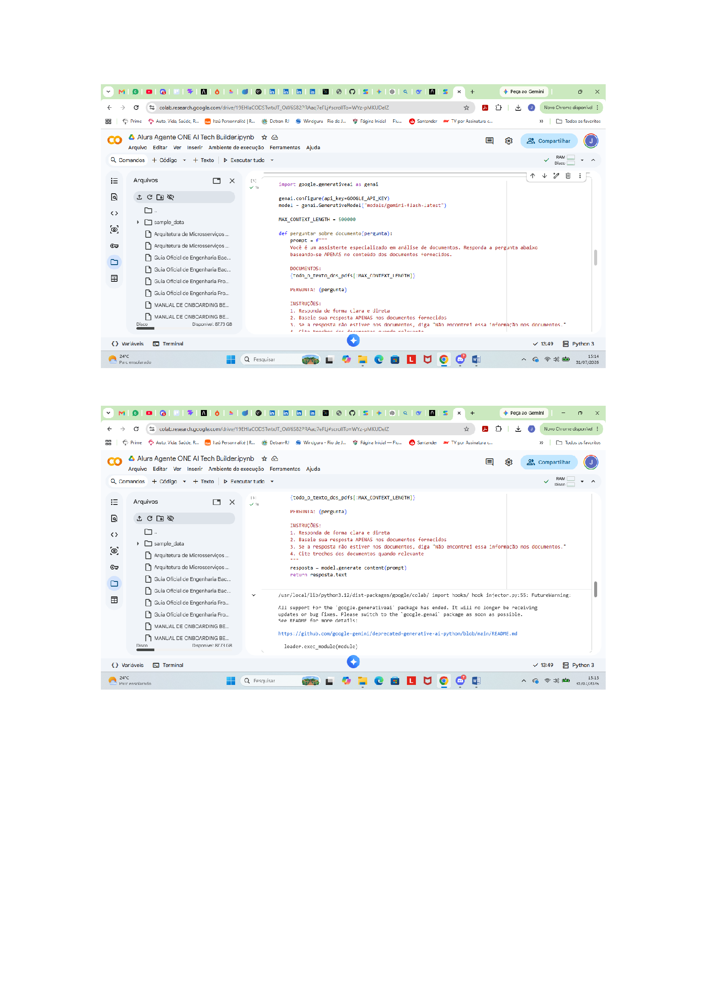
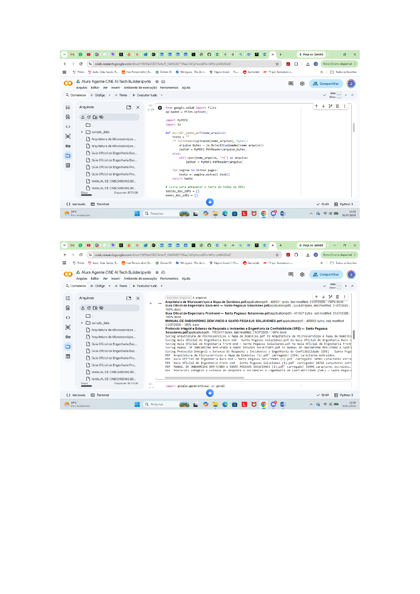
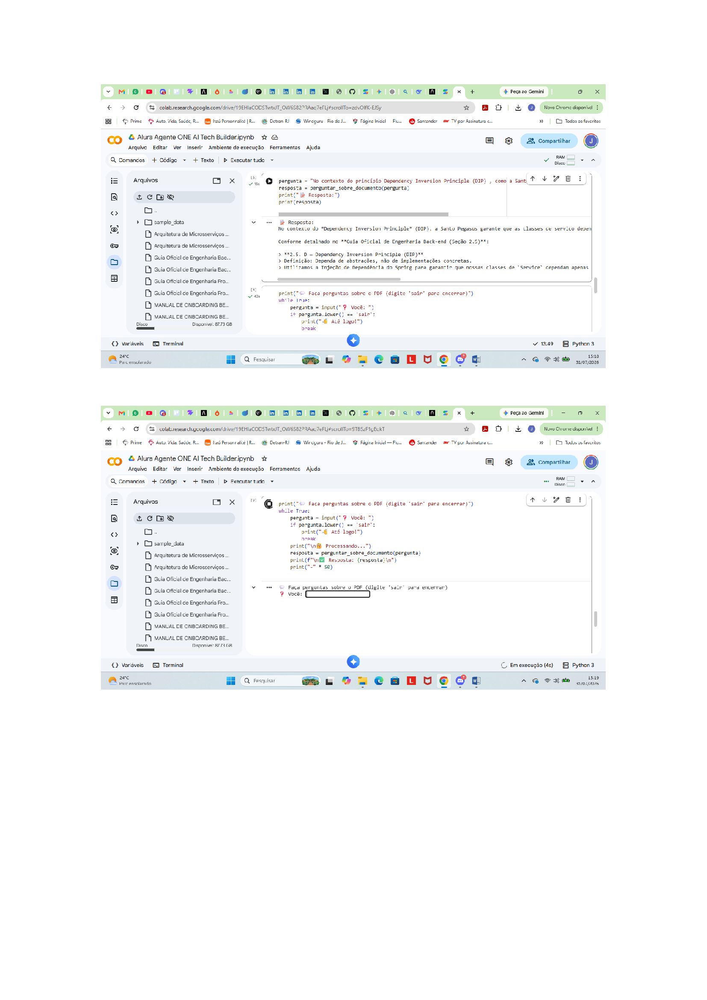
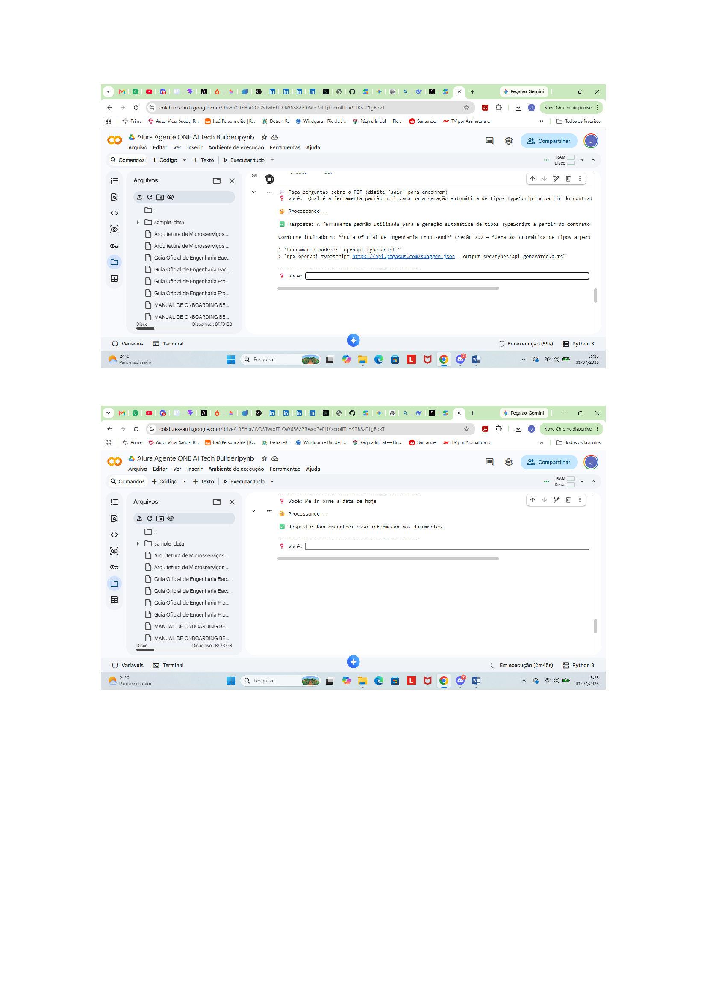

# Alura-Agente-ONE-AI-Tech-Builder


Agente de IA desenvolvido como parte do desafio **ONE AI Tech Builder**. 
Ele foi criado para atuar como um assistente virtual especializado na análise e consulta de 
documentos técnicos da Santo Pegasus Soluciones, uma empresa de tecnologia do setor de saúde

## 📌 Sobre o Projeto

O agente utiliza o **Google Gemini (Flash)** para processamento de linguagem natural e tem como 
objetivo facilitar o acesso à informação técnica, acelerando o onboarding de novos colaboradores 
e auxiliando times de engenharia na consulta rápida de documentação.

## 🎯 Funcionalidades

- Extração e processamento de texto de múltiplos PDFs
- Respostas baseadas exclusivamente no conteúdo dos documentos fornecidos
- Interface interativa no Google Colab para perguntas e respostas
- Busca inteligente por trechos relevantes dos documentos
- Respostas rápidas e diretas com citação das fontes

## 🛠️ Tecnologias Utilizadas

- **Google Gemini (Flash)** - Modelo de linguagem para respostas rápidas
- **PyPDF2** - Extração de texto de arquivos PDF
- **Google Colab** - Ambiente de desenvolvimento e execução
- **Python** - Linguagem de programação

## 📁 Estrutura do Projeto

```

├── challenge_one_ai_tech_builder.ipynb # Notebook principal
├── docs/ # Documentos técnicos (PDFs)
├── src/ # Código fonte
│ ├── core/ # Lógica principal
│ ├── rag/ # Sistema RAG (futuro)
│ └── utils/ # Funções auxiliares
├── tests/ # Testes automatizados
├── README.md # Documentação
├── requirements.txt # Dependências
└── .env.example # Variáveis de ambiente

```

## 📂 Documentos Analisados

- Arquitetura de Microsserviços e Mapa de Domínios
- Guia Oficial de Engenharia Back-end
- Guia Oficial de Engenharia Front-end
- Manual de Onboarding
- Protocolo de Resposta a Incidentes (SRE)

## 🚀 Como Executar

1. Abra o notebook no Google Colab
2. Configure a chave da API Gemini no gerenciador de secrets (`Alura_Agente`)
3. Execute todas as células
4. Faça upload dos PDFs quando solicitado
5. Comece a fazer perguntas sobre os documentos!

## 📝 Exemplo de Perguntas

- "Qual é o princípio arquitetônico que proíbe o acesso direto ao banco de dados de outro microsserviço?"
- "Quais são os pilares da cultura Engineering Excellence da Santo Pegasus?"
- "Como funciona o fluxo de resposta a incidentes SEV-1?"
- "Quais tecnologias são utilizadas no ecossistema back-end?"

## 📷 Capturas de Telas

### Base de Processamento



### Carregamento dos PDFs



### Teste Rápido e Tela de Pergunta



### Pergunta Respondida e Conteúdo Não Encontrado



## 🔮 Roadmap do Projeto

### 🟢 Concluído

- ✅ Extração e processamento de PDFs com PyPDF2
- ✅ Integração com Google Gemini API
- ✅ Interface interativa no Google Colab

### 🔴 Planejado

- ⏳ Sistema RAG com ChromaDB
- ⏳ Interface web com Streamlit
- ⏳ Cache inteligente de respostas
- 📋 API REST com FastAPI
- 📋 Integração com Slack/Teams
- 📋 Dashboard de métricas e monitoramento
- 📋 Fine-tuning do modelo para HealthTech

## ✅ Status do Agente

O agente está **funcionando perfeitamente**, processando consultas sobre a documentação técnica da Santo Pegasus Soluciones com **tempo médio de resposta inferior a 2 segundos**.

- ✅ Extração de PDFs: OK
- ✅ Processamento de texto: OK
- ✅ API Gemini: OK
- ✅ Respostas baseadas em contexto: OK

## 🙏 Agradecimentos

- **Alura** - Pelo conteúdo de excelência e metodologia que transforma vidas
- **Oracle** - Pelo programa ONE que abre portas para novos talentos
- **Instrutores** - Pela dedicação, paciência e conhecimento compartilhado
- **Mentores** - Pelos feedbacks valiosos e direcionamento durante o desafio
- **Santo Pegasus** - Pela documentação rica que serviu como base para o agente
- **Google** - Pela API Gemini que deu vida ao assistente
- **Comunidade ONE** - Pelas trocas e parcerias ao longo da jornada

## 👤 Autor

- **Nome** - João Clark
- **LinkedIn** - https://www.linkedin.com/in/joaoclark/

### 🌟 Projeto desenvolvido durante o desafio **AI Tech Builder** do **ONE - Oracle Next Education**, em parceria com a **Alura**.

